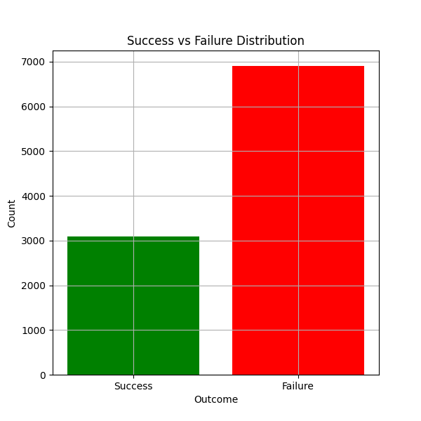
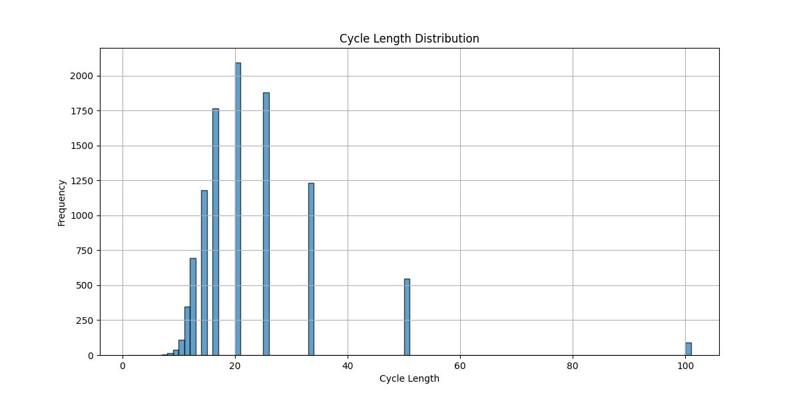
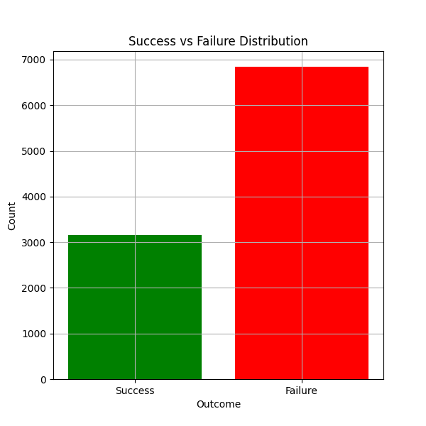

## test a: 
 

- Success Rate: 30.95%
- Mean Cycle Length: 22.72
- Median Cycle Length: 20.00
- Standard Deviation of Cycle Length: 11.75

## test b: 
 

- Success Rate: 31.56%
- Mean Cycle Length: 22.66
- Median Cycle Length: 20.00
- Standard Deviation of Cycle Length: 11.83
