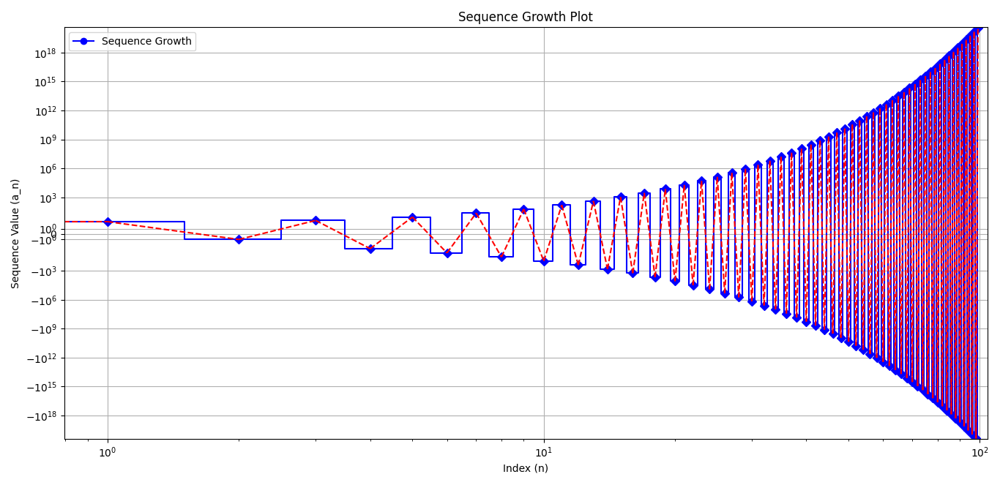

### **Understanding Recursive Sequences: An Exploration of Rapid Growth**

In the realm of mathematics, sequences play a vital role in understanding how numbers behave when they follow specific patterns. One fascinating type of sequence is a **recursive sequence**, where each term depends on the values of the previous terms. Recursive sequences can lead to surprising and sometimes fast-growing patterns. In this article, we will explore such a sequence, analyze its behavior, and explain how its growth can become exponential-like over time.

### **The Sequence Definition**

Consider the following recursive formula:

$$\[
a_n = a_{n-2} - a_{n-1}
\]$$

Where:
- $$\( a_0 = 2 \)$$
- $$\( a_1 = 3 \)$$

This formula means that to find the $$\( n \)$$-th term, you subtract the previous term $$\( a_{n-1} \)$$ from the term two places earlier $$\( a_{n-2} \)$$. This sequence starts innocently enough with small numbers, but as we'll see, its growth accelerates rapidly, leading to large values.

### **Generating the Sequence: A Simple Example**

Let's compute the first few terms of the sequence using the formula:

- $$\( a_0 = 2 \)$$
- $$\( a_1 = 3 \)$$
- $$\( a_2 = a_0 - a_1 = 2 - 3 = -1 \)$$
- $$\( a_3 = a_1 - a_2 = 3 - (-1) = 4 \)$$
- $$\( a_4 = a_2 - a_3 = -1 - 4 = -5 \)$$
- $$\( a_5 = a_3 - a_4 = 4 - (-5) = 9 \)$$

At first glance, the sequence appears to alternate between positive and negative numbers, creating a somewhat erratic pattern. However, the absolute values of the numbers start increasing rapidly as we progress through the sequence.

Here are the first 20 terms of this sequence:

$$\[
[2, 3, -1, 4, -5, 9, -14, 23, -37, 60, -97, 157, -254, 411, -665, 1076, -1741, 2817, -4558, 7375]
\]$$

As you can see, the values are growing in magnitude, and although the signs alternate between positive and negative, the absolute values are increasing at a fast pace.

### **Analyzing the Growth: Exponential Behavior**

To better understand the rapid growth of this sequence, let's focus on the absolute values of the terms. Although the sequence alternates in sign, the absolute value of each term grows quickly, suggesting that the growth rate might be similar to an exponential function.

We can calculate the **growth ratio** between consecutive terms by taking the absolute value of each term and dividing it by the previous term. This ratio helps us understand how quickly the sequence grows. For example:

$$\[
\frac{|3|}{|2|} = 1.5, \quad \frac{|4|}{|3|} \approx 1.33, \quad \frac{|9|}{|5|} = 1.8
\]$$

As we progress further, the growth ratios begin to stabilize. Around the 10th term, the ratio hovers between 1.6 and 2.0. This means that on average, each new term is about **1.6 to 2 times larger** than the previous one.

### **Visualizing the Sequence**

To see this growth more clearly, we can plot the sequence to visualize how the terms change. Below is a simple graph that plots the first 100 terms of the sequence.

In the graph, you can see how the sequence oscillates between positive and negative values. The large jumps between consecutive terms create sharp spikes, reflecting the alternating nature of the sequence. However, what’s most striking is the rapid increase in the absolute values as the sequence progresses, with the magnitude of the terms growing larger over time.

### **Explaining the Growth Rate**

Why does this sequence grow so fast? The answer lies in the recursive relation:

$$\[
a_n = a_{n-2} - a_{n-1}
\]$$

This formula causes the terms to build on each other in a way that increases their magnitude. Every time a new term is calculated, the subtraction of two previously large terms results in an even larger term. This creates a **compounding effect**, where the size of each new term is influenced by the magnitude of the two previous terms. Over time, this leads to exponential-like growth.

### **Mathematical Interpretation of Growth**

To quantify the rate of growth, we look at the ratio between consecutive terms, denoted as $$\( r_n \)$$:

$$\[
r_n = \frac{|a_{n+1}|}{|a_n|}
\]$$

As observed earlier, this ratio stabilizes between **1.6 and 2.0** for large $$\( n \)$$. This indicates that the sequence grows at a rate similar to that of an exponential function. In mathematical terms, the sequence exhibits growth behavior that can be approximated as:

$$\[
|a_n| \approx C \cdot 1.8^n
\]$$

Where $$\( C \)$$ is some constant. This approximation shows that the sequence’s magnitude grows exponentially, even though it is generated by a simple subtraction rule.

### **Conclusion: Recursive Sequences and Rapid Growth**

The sequence we explored in this article is a fascinating example of how simple recursive formulas can lead to complex behavior, including rapid growth. Despite the alternating signs and unpredictable individual values, the overall pattern shows exponential-like growth in magnitude. This kind of sequence has applications in various fields, including computer science, cryptography, and even biology, where recursive relationships often define growth processes.

By analyzing the sequence, calculating its growth ratios, and visualizing its behavior, we’ve gained insight into how a seemingly straightforward formula can generate large and fast-growing numbers. The next time you encounter a recursive sequence, consider its growth potential—what starts as a small number may grow much faster than expected!
